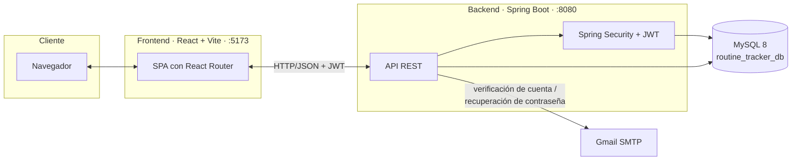
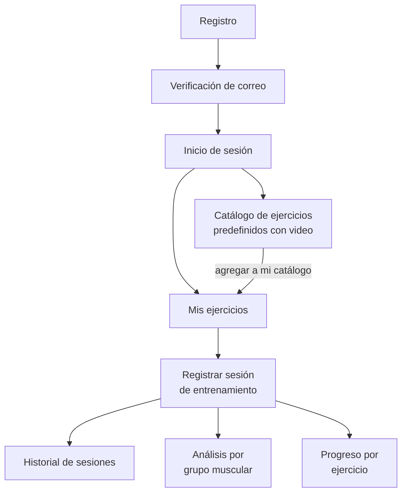

# Routine Tracker

Aplicación web para el seguimiento y control de rutinas de entrenamiento en gimnasio: registro de ejercicios (con catálogo predefinido y video demostrativo), sesiones de entrenamiento, historial, análisis por grupo muscular y seguimiento de progreso por ejercicio.

Trabajo de titulación de Dylan Vallejo (Tecnólogo Superior en Desarrollo de Software, Instituto Superior Tecnológico Rumiñahui).

## Capturas

<table>
<tr>
<td width="50%"><b>Login</b><br></td>
<td width="50%"><b>Panel de inicio</b><br></td>
</tr>
<tr>
<td><b>Mis ejercicios</b><br></td>
<td><b>Catálogo de ejercicios</b><br></td>
</tr>
<tr>
<td><b>Historial de sesiones</b><br></td>
<td><b>Detalle de sesión</b><br></td>
</tr>
<tr>
<td><b>Análisis muscular</b><br></td>
<td><b>Progreso por ejercicio</b><br></td>
</tr>
</table>

<details>
<summary>Vista responsive (móvil)</summary>


</details>

## Cómo funciona



El frontend es una SPA en React que consume la API REST del backend por HTTP, autenticando cada request con un JWT emitido en el login. El backend valida y persiste todo contra MySQL, y envía correos reales (verificación de cuenta, recuperación de contraseña) vía SMTP de Gmail.

### Flujo de uso



## Funcionalidades

- **Autenticación** — registro, login con JWT, verificación de cuenta y recuperación de contraseña por correo (enlace con token de un solo uso).
- **Ejercicios** — CRUD propio por usuario, con video demostrativo de YouTube embebido; catálogo predefinido de 18 ejercicios agrupados por grupo muscular para agregar al listado propio.
- **Sesiones de entrenamiento** — registro de series/repeticiones/peso por ejercicio, con rangos de referencia (hipertrofia/resistencia) y validación de fecha.
- **Historial** — listado filtrable por rango de fechas, con vista de detalle por sesión.
- **Análisis muscular** — frecuencia de entrenamiento por grupo muscular y volumen semanal (sets) contra referencias MEV/MAV/MRV, filtrable por período y grupo.
- **Progreso** — evolución de peso/repeticiones por ejercicio a lo largo del tiempo, con máximos y mínimos destacados.

## Stack

- **Backend**: Java 17, Spring Boot 3.3, Spring Security + JWT, Spring Data JPA, Spring Mail
- **Frontend**: React 18, Vite, React Router, Axios, Chart.js
- **Base de datos**: MySQL 8

## Estructura

```
backend/    API REST (Spring Boot)
frontend/   Interfaz de usuario (React)
docs/       Capturas y material de referencia
```

## Requisitos previos

- Java 17+ y Maven
- Node.js 18+ y npm
- MySQL 8 corriendo localmente (el esquema `routine_tracker_db` se crea automáticamente)

## Cómo levantar el proyecto

### Backend

```bash
cd backend
mvn spring-boot:run
```

Corre en `http://localhost:8080`. Las credenciales de la base de datos se configuran con las variables de entorno `DB_USERNAME` y `DB_PASSWORD` (por defecto `root`/`root`, ver `src/main/resources/application.properties`).

Para envío real de correo (verificación/recuperación), configurar `MAIL_ENABLED=true`, `MAIL_USERNAME` y `MAIL_PASSWORD` (App Password de Gmail) como variables de entorno, o en un `application-local.properties` local (no versionado). Sin esto, el envío queda en modo desarrollo: el enlace se escribe en el log en vez de enviarse.

### Frontend

```bash
cd frontend
npm install
npm run dev
```

Corre en `http://localhost:5173`. La URL de la API se configura en `frontend/.env` (`VITE_API_URL`), ver `frontend/.env.example`.

## Metodología

El desarrollo sigue Scrum, organizado en 6 Sprints (uno por Historia de Usuario), cada uno en su propia rama (`sprint-1-autenticacion`, `sprint-2-ejercicios`, etc.), más ramas adicionales para mejoras posteriores (rangos de entrenamiento, verificación por correo, catálogo de ejercicios, rediseño visual, entre otras).
